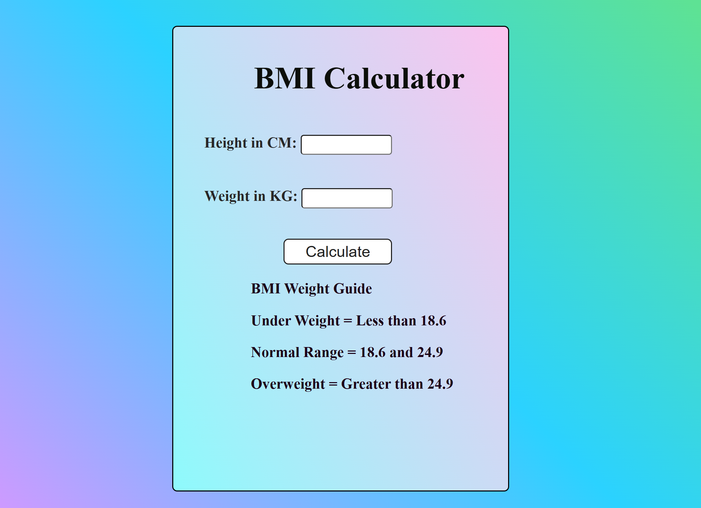

# BMI-Calculator

## Description

The BMI Calculator is a web application built using **HTML, CSS, and JavaScript**. It calculates the Body Mass Index (BMI) based on user-provided height in centimeters and weight in kilograms. After entering the values and clicking on "Calculate", it displays the BMI value and provides a message indicating whether the BMI is underweight, normal, or overweight based on predefined ranges. 

## Usage

1. **Input**: 
   - Enter your height in **centimeters**.
   - Enter your weight in **kilograms**.

2. **Calculate**: 
   - Click on the "Calculate" button to determine your BMI.

3. **Output**: 
   - The BMI value will be displayed.
   - A message will indicate whether your BMI falls under "Under Weight", "Normal Range", or "Overweight" based on the following guide:

   - **BMI Weight Guide**:
     - Under Weight: Less than 18.6
     - Normal Range: 18.6 to 24.9
     - Overweight: Greater than 24.9

## Installation

There is no installation required to run the BMI Calculator. Simply open the `index.html` file in your web browser.

